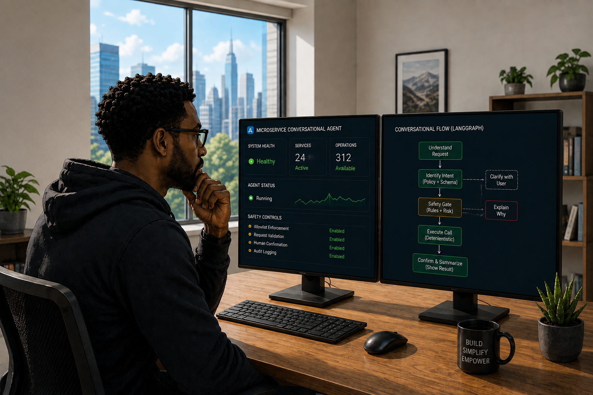
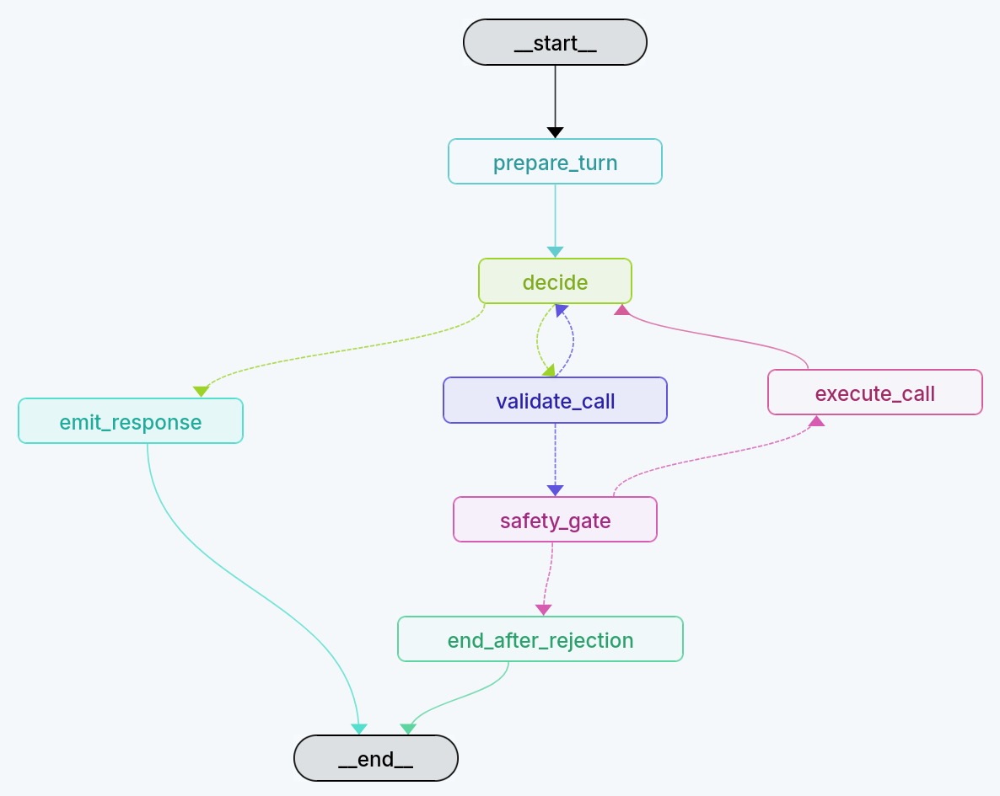

# Microservice Conversational Agent

A Kubernetes-deployable LangGraph conversational layer that enables natural-language understanding and safe operation of REST microservices through a semantic Service Digest.

The included Order/Fulfillment service serves as the reference implementation and demonstration domain.

## Why this project exists

Jack leads an engineering organization responsible for building and operating a growing portfolio of REST microservices. Each service exposes its own APIs, domain model, business rules, validation constraints, workflows, and operational assumptions. Some services are well documented; others rely on a combination of OpenAPI definitions, source code, tests, internal documentation, and knowledge held by the engineers who built them.

The services themselves are already accessible through APIs. But understanding how to use those APIs correctly is a different problem. Engineers and other technical users still need to determine which endpoint to call, what information is required, how different operations relate to one another, what business rules apply, and whether a requested action is safe in the service's current state.

Jack starts asking a different question:

> What if a microservice could expose not only a machine-readable API, but also enough semantic knowledge for an AI agent to understand what the service does, reason about its capabilities and constraints, and safely operate it through natural language?

A user might simply ask, "Show me the orders currently in the system," rather than locating the correct endpoint and constructing the request manually. They might ask, "Can this order still be cancelled?" and expect the system to reason over the service's business rules before taking any action. For operations that modify state, the agent could validate the request, resolve the correct service operation, and require explicit confirmation whenever the action carries meaningful risk.

But giving an LLM unrestricted access to a REST service would introduce a different class of problems. The model should not invent URLs, bypass validation, or decide on its own how an HTTP request should be constructed. The reasoning layer therefore needs to be separated from the execution layer.

This project explores that architecture. Service knowledge is captured in a structured **Service Digest** describing the service's purpose, domain model, operations, schemas, workflows, business rules, safety requirements, and conversational semantics. A LangGraph-based agent reasons over that digest to understand user intent and select an appropriate operation, while deterministic application code validates parameters, enforces safety policies, constructs the HTTP request, and executes only allowlisted service operations.

The included Order/Fulfillment service serves as the reference implementation, but the broader goal is to explore a reusable conversational layer that can sit in front of arbitrary REST microservices while keeping API execution constrained, explainable, and under deterministic safety controls.

<p align="center">
  
</p>

## Architecture

```text
                  LangSmith Studio
                  Chat + Graph UI
                         |
                         v
              LangGraph Agent Server
              namespace: conversational-layer
                         |
                 +-------+--------+
                 |                |
                 v                v
       service-digest.yaml    thread state
                 |                |
                 +-------+--------+
                         v
                   LLM planner
                         |
                         v
                canonical operation
                         |
                         v
             deterministic validator
                         |
                    safety gate
                         |
                 interrupt if needed
                         |
                         v
               deterministic executor
                         |
                         v
       Order/Fulfillment REST Service
       namespace: order-fulfillment
                         |
                         v
                     PostgreSQL
```

## What the agent can do

- answer questions about service purpose and capabilities;
- explain entities, state machines, workflows, business rules, errors, and API methods;
- distinguish stable service knowledge from current runtime data;
- query live customers, products, orders, shipments, returns, refunds, and timelines;
- resolve conversational references across a thread;
- plan multi-call workflows one operation at a time;
- invoke any of the 30 digest-defined operations;
- validate path/query/body inputs against the embedded OpenAPI contract;
- require LangGraph human-in-the-loop confirmation for operations marked risky in the digest;
- interpret backend business errors conversationally.


## LangGraph workflow

The LangGraph workflow gives the conversational agent a structured execution model in which natural-language reasoning, API validation, safety enforcement, deterministic execution, and user-facing responses are represented as separate stages. The graph deliberately avoids placing the entire interaction inside one unconstrained agent loop. Instead, the LLM is responsible for understanding the user's intent and selecting an appropriate service operation, while deterministic application logic validates and executes that operation according to the Service Digest.

Every conversation begins with **`prepare_turn`**, which prepares the current conversational context and known service entities before passing control to **`decide`**. The `decide` node is the main reasoning and routing stage. Using the Service Digest, conversation history, and available service operations, it determines whether the agent can answer directly, needs to invoke a REST operation, or needs additional reasoning after an operation has completed.

The workflow contains three main execution paths:

- **Knowledge and conversational responses**: when the user's question can be answered from the Service Digest or existing conversational context, `decide` routes directly to **`emit_response`**. No backend REST operation is executed.

- **Validated service invocation**: when the request requires live service data or an action against the microservice, `decide` produces a structured operation request and routes it to **`validate_call`**. The requested operation, path parameters, query parameters, and request body are validated against the operation definition and schemas contained in the Service Digest before execution can continue.

- **Safety-controlled execution**: validated operations pass through **`safety_gate`**, where deterministic policy evaluates the operation's effect, risk classification, and confirmation requirements. Permitted operations continue to **`execute_call`**, while rejected or unapproved operations are routed to **`end_after_rejection`** without calling the backend service.

After **`execute_call`**, the result is returned to `decide` rather than being sent directly to the user. This allows the agent to reason over actual service results, resolve additional entities, determine whether another service operation is required, or construct the final conversational response. Multi-step requests can therefore progress through several controlled API calls while each individual invocation still passes through validation and safety enforcement.

The graph deliberately separates:

- conversational reasoning from REST execution,
- Service Digest knowledge from live service data,
- LLM-selected operations from deterministic HTTP request construction,
- schema validation from safety authorization,
- safe execution from rejected execution,
- backend results from the final user-facing response.

This separation establishes the central safety boundary of the project: **the LLM can decide what the user is trying to accomplish, but it cannot directly construct or execute arbitrary HTTP requests**. Only operations defined in the Service Digest and accepted by the deterministic validation and safety layers can reach the microservice.



## Critical execution boundary

The LLM **cannot issue raw HTTP requests**.

It returns only:

```yaml
operation_id: cancel_order
path_params:
  order_id: ORD-123
body:
  reason: Customer changed mind
```

The deterministic runtime retrieves the method/path from the digest, validates the arguments, checks confirmation policy, and then performs the request. Unknown operation IDs are blocked.

## Prerequisites

Your existing lab should already have:

- Ubuntu 24.04 VM
- kubeadm Kubernetes node
- containerd Kubernetes runtime
- Docker available for local image builds
- Calico networking
- running Order/Fulfillment service in namespace `order-fulfillment`
- Order/Fulfillment NodePort health at `http://192.168.253.10:30080/health`

You also need:

- an OpenAI API key for the model;
- a LangSmith account/API key for Studio connectivity.

## Project layout

```text
.
├── digest/
│   └── order-fulfillment-service-digest.yaml
├── docs/
│   ├── ARCHITECTURE.md
│   ├── EXAMPLE_CONVERSATIONS.md
│   ├── SECURITY.md
│   ├── STUDIO.md
│   └── REFERENCES.md
├── k8s/
│   ├── 00-namespace.yaml
│   ├── 01-configmap.yaml
│   ├── 01-secret.example.yaml
│   ├── 02-deployment.yaml
│   └── 03-service.yaml
├── scripts/
├── src/conversational_agent/
├── tests/
├── Dockerfile
├── langgraph.json
└── pyproject.toml
```

# Deploy to your Kubernetes lab

## 1. Verify the existing service

```bash
kubectl get pods,svc -n order-fulfillment
curl -fsS http://192.168.253.10:30080/health
```

## 2. Start Docker if needed

```bash
sudo systemctl start docker
```

## 3. Build and import the agent image into Kubernetes containerd

```bash
./scripts/build-and-load.sh
```

Verify:

```bash
sudo ctr -n k8s.io images list | grep microservice-conversational-agent
```

## 4. Create Kubernetes secrets without writing them to disk

```bash
export OPENAI_API_KEY='...'
export LANGSMITH_API_KEY='...'
./scripts/create-secrets.sh
```

## 5. Deploy

```bash
./scripts/deploy.sh
```

Expected service:

```text
conversational-agent   NodePort   ...   2024:30204/TCP
```

Check:

```bash
curl -fsS http://192.168.253.10:30204/ok
```

## 6. Run smoke tests

Knowledge/digest question:

```bash
./scripts/smoke-knowledge.sh
```

Live read through the Order/Fulfillment API:

```bash
./scripts/smoke-runtime-read.sh
```

Optional command-line human-in-the-loop demo (use an eligible unshipped order ID):

```bash
./scripts/demo-confirmation.sh ORD-...
```

The script runs until the LangGraph interrupt, shows the exact pending operation, and resumes with approve/reject.

# Open in Studio

Recommended from a browser running on the Ubuntu VM:

```bash
./scripts/port-forward.sh
```

Keep that terminal open. Then open:

```text
https://smith.langchain.com/studio/?baseUrl=http://127.0.0.1:2024
```

Select the graph/assistant named:

```text
service_agent
```

See `docs/STUDIO.md` for showcase scenarios and browser troubleshooting.

# Local development without Kubernetes

Create an environment and install:

```bash
python3 -m venv .venv
source .venv/bin/activate
pip install -e '.[dev]'
cp .env.example .env
```

Set `.env` so `ORDER_SERVICE_BASE_URL` points at the existing Order service NodePort, then:

```bash
./scripts/run-local.sh
```

# Tests

```bash
pip install -e '.[dev]'
pytest -q
```

The unit tests do not call the LLM. They validate the digest loader, contract validator, allowlisted REST executor, and confirmation parser.

# Important deployment note

This package intentionally runs **`langgraph dev` in Kubernetes** for the showcase. Current LangGraph documentation describes that Agent Server mode as a development/testing server, while production self-hosted Agent Server deployment uses a different licensed stack with durable backing services. This project therefore demonstrates the agent and Studio experience on your lab cluster without pretending that the dev server is a production deployment.

For a production evolution, replace the showcase Agent Server with a supported production deployment, durable persistence, TLS/Ingress, authentication/authorization, network policies, and proper secret management.
